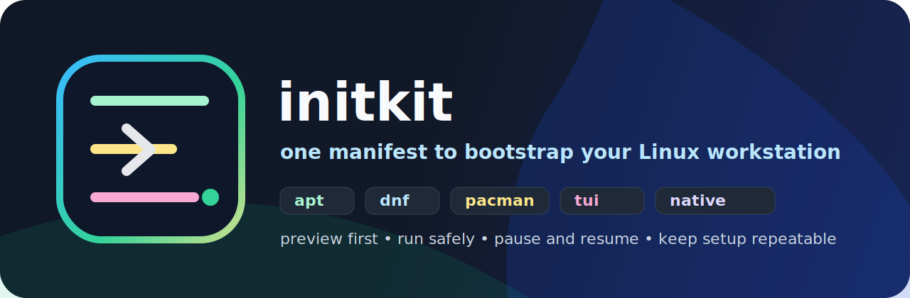

<p align="center">
  
</p>

<p align="center">
  <a href="https://github.com/worxbend/initkit/actions/workflows/native-release.yml"></a>
  
  
  
  
</p>

<p align="center">
  <b>Turn a fresh Linux machine into your machine.</b><br>
  One YAML file. One preview. One run. CLI or fancy TUI. No mystery bash soup.
</p>

---

## What Is Initkit?

`initkit` is a friendly workstation bootstrapper.

You write a small Kubernetes-style YAML file that says:

- which packages you want
- which installer should handle them: `apt`, `dnf`, `pacman`, `zypper`, `flatpak`, `snap`, direct binary downloads, shell installers, Nerd Fonts, dotfiles, or commands
- which operating systems each step belongs to
- which steps can run in parallel
- where to save state if you need to pause, log out, reboot, and continue later

Then Initkit shows you what it is about to do and runs the matching steps for the current machine.

Think of it like:

> "Here is my developer laptop recipe. Please apply only the parts that make sense on this distro."

## Why It Exists

Fresh machines are exciting for about five minutes. Then you remember you need Git, Zsh, Docker, Flatpak apps, `kubectl`, Rust, fonts, dotfiles, shell setup, and that one command you always forget.

Initkit makes that boring setup repeatable without turning your dotfiles repo into a giant pile of shell scripts.

## The Vibe

- 🧠 **Simple YAML** instead of custom bash logic everywhere
- 🧪 **Dry-run first** so you can inspect the plan before touching the machine
- 🐧 **Distro-aware** package steps for Ubuntu, Fedora, Arch/EndeavourOS, openSUSE, and friends
- 🧰 **Many installer kinds** in one plan
- 🧾 **State files** for interrupt/resume flows
- 🎨 **Colorful CLI** for normal terminals
- 🕹️ **Interactive TUI** for picking steps with checkboxes
- 🚀 **Native Linux binary** via GraalVM release workflow

## Tiny Example

```yaml
apiVersion: initkit.io/v1alpha1
kind: WorkstationProfile

metadata:
  name: my-laptop

spec:
  policy:
    dryRun: false
    requireSudo: true

  plan:
    - name: fedora-cli
      kind: dnf-packages
      when:
        os:
          family: linux
          distribution: fedora
      spec:
        install:
          - "@development-tools"
          - git
          - curl
          - jq
          - zsh

    - name: kubectl
      kind: binary-downloads
      execution:
        mode: parallel
        maxConcurrency: 4
      spec:
        items:
          - name: kubectl
            url: https://dl.k8s.io/release/v1.30.2/bin/linux/amd64/kubectl
            destination: "${HOME}/.local/bin/kubectl"
            mode: "0755"
```

Package managers install one item at a time. If `git` works but `some-wrong-name` fails, Initkit still attempts the next package and reports the partial failure clearly.

## Install

Native Linux amd64 builds are published from tags by GitHub Actions.

```bash
curl -L -o initkit \
  https://github.com/worxbend/initkit/releases/latest/download/initkit-linux-amd64
chmod +x initkit
sudo mv initkit /usr/local/bin/initkit
```

If you are hacking on the repo, you do not need a global Mill install. The checked-in `./mill` launcher is enough.

## Run It

Preview the example without changing your machine:

```bash
./mill app.run apply --config config.example.yaml --dry-run
```

Apply it:

```bash
./mill app.run apply --config config.example.yaml
```

Open the TUI:

```bash
./mill app.run tui --config config.example.yaml
```

Run only package steps:

```bash
./mill app.run apply --config config.example.yaml --only apt-packages --dry-run
```

Skip something:

```bash
./mill app.run apply --config config.example.yaml --skip snap-packages
```

Use a state file:

```bash
./mill app.run apply \
  --config config.example.yaml \
  --state ~/.local/state/initkit/developer-workstation.state.json
```

## Native Binary Workflow

From a release download:

```bash
initkit apply --config config.example.yaml --dry-run
initkit tui --config config.example.yaml
```

From source:

```bash
./mill app.run --help
./mill app.run apply --help
./mill app.run tui --help
```

Build a native image locally when GraalVM is installed:

```bash
GRAALVM_HOME=/path/to/graalvm ./mill app.nativeImage
```

The release workflow builds the Linux amd64 native image for `v*` tags.

## Build From Source

Requirements:

- JDK 21+
- Linux for the real package-manager workflows
- GraalVM 21 only if you want native-image locally

Common development commands:

```bash
./mill __.compile
./mill __.test
./mill app.run --help
./mill app.run apply --config config.example.yaml --dry-run
```

Formatting:

```bash
./mill mill.scalalib.scalafmt/checkFormatAll
./mill mill.scalalib.scalafmt/reformatAll
```

## Docs

- 📘 [Config structure](docs/config-structure.md)
- 🧪 [Example profiles](docs/examples.md)
- 🧑‍💻 [Developer guide](docs/developer-guide.md)
- 🏗️ [Architecture overview](docs/architecture.md)

Copy-pasteable distro examples:

- [Ubuntu](docs/examples/ubuntu.yaml)
- [Fedora](docs/examples/fedora.yaml)
- [EndeavourOS / Arch](docs/examples/endeavouros.yaml)
- [openSUSE Tumbleweed](docs/examples/opensuse-tumbleweed.yaml)

## Project Status

Initkit is young, useful, and still moving fast. The manifest API is currently `initkit.io/v1alpha1`, which means the shape is intentionally explicit but still allowed to evolve.

Use dry-run. Read the plan. Then let it cook.

## Contributing

Small, boring improvements are welcome:

- clearer docs
- more distro examples
- better validation messages
- more installer kinds
- sharper TUI details
- safer execution edges

Start with [docs/developer-guide.md](docs/developer-guide.md).

---

<p align="center">
  <b>Initkit</b> - because "new laptop day" should feel fun, not like archaeology.
</p>
